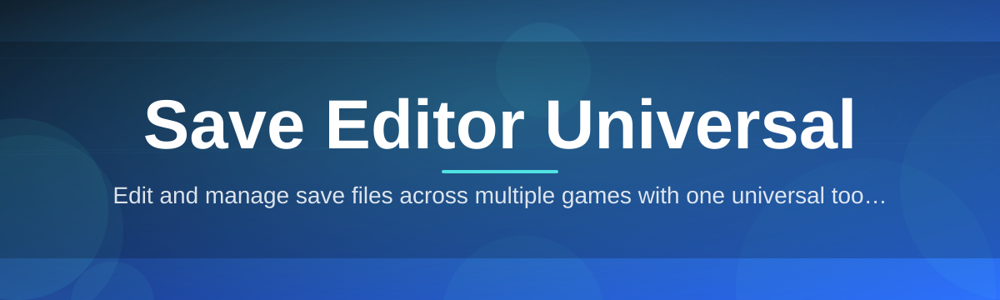
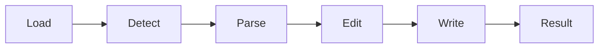

# save-editor-universal-tool 🧩💾

  

*One editor, every save file — stop hunting for one-off tools and start owning your progress.*

  

## 🕳️ What This Is NOT

> Let's clear the air before anything else.

**save-editor-universal-tool is NOT:**

- A game-specific mod manager tied to a single title
- A cloud service that uploads your saves anywhere
- A patcher that touches your game's executable or DLLs
- Something that requires a dozen dependencies just to open a `.sav` file

What it **IS**: a single, self-contained Windows application that reads, decodes, and rewrites save file formats across a huge range of games — without forcing you to learn a hex editor or trust a sketchy forum-posted script.

---

## 🔎 Overview

Save files are a mess. Every studio invents its own format — some are plain JSON, some are gzip-wrapped binary blobs, some roll their own checksum scheme just to make tampering annoying. If you've ever wanted to fix a corrupted save, rename a character, adjust a stat that got bugged by a patch, or just peek at what's actually stored on disk, you know the usual routine: download a random single-purpose editor, hope it still works after the last game update, and repeat that search for every new title you play.

**save-editor-universal-tool** exists to end that cycle. It's built around a modular parsing engine that treats "save file editing" as a general problem — detect the format, map the structure, expose it in a readable UI, write it back safely. Instead of one tool per game, you get one tool that grows a library of format definitions over time, all wrapped in the same consistent interface. Whether you're restoring a lost inventory, correcting a broken quest flag, or just archiving your progress before an update wipes it, the workflow stays identical.

This is for players who treat their save data as *their* data — hobbyists, speedrunners resetting specific states, and anyone who's been burned by a save going corrupt with no way to recover it. It's not about altering how a game plays live; it's about giving you a transparent, reliable way to inspect and repair the files that already belong to you.

  

---

## 🧠 What Actually Sucked Before This

Save editing used to mean: five browser tabs open, three of them dead links, one requiring a login you don't have, and a `.exe` you're not sure you trust. Formats changed with every game patch, and most single-purpose tools were abandoned the moment their author lost interest.

**The fix:** a universal detection layer that identifies the save format on load, a shared editing shell that doesn't care what game you're working with, and a maintained format library that gets updated independently of any one game's patch cycle. One tool, one interface, no guesswork.

---

## ⚙️ Core Capabilities

- **Universal format detection** — drop in a save file and the tool fingerprints its structure automatically instead of asking you to pick a game from a dropdown that might not even list it.

- **Structured field editor** — numbers, strings, booleans, and nested arrays are rendered as actual editable fields, not raw hex you have to decode by hand.

- **Automatic backup on load** — every file you open gets a timestamped copy stashed before a single byte changes, so "I broke my save" is never a permanent state.

- **Checksum & integrity recalculation** — many formats reject files with a mismatched checksum; the tool recalculates and reapplies it automatically on save.

- **Batch value search** — find every instance of a value across a save's structure (useful for tracking down where a specific stat or flag actually lives).

- **Raw hex fallback view** — for the formats without full structured support yet, a built-in hex viewer keeps you from needing a second app.

- **Format plugin architecture** — new save formats ship as lightweight definitions rather than full rewrites, so support expands without bloating the core app.

- **Offline-first design** — nothing you open ever leaves your machine; there's no upload step anywhere in the pipeline.

> [!TIP]
> Use the **field search bar** (`Ctrl+F` inside the editor pane) to jump straight to a value instead of scrolling a giant nested tree.

---

## 🚀 How To Get Started

1. Open the landing page using the download button above.

2. Grab the latest standalone build — it's a single package, no installer wizard required.

3. Run the executable directly; Windows may show a SmartScreen prompt on first launch since the binary is unsigned by a major certificate authority.

4. Load a save file via **File → Open**, review the detected format in the status bar, and start editing.

> [!NOTE]
> First launch on a fresh system may take a few extra seconds while the format library initializes. Subsequent launches are near-instant.

---

## 🖥️ System Requirements

| Requirement | Detail |
|---|---|
| OS | Windows 10 or Windows 11 (64-bit) |
| Dependencies | None — fully standalone |
| Disk space | Under 150 MB |
| RAM | 4 GB minimum, 8 GB recommended for large save archives |
| Internet | Only needed to download the build itself |

> [!IMPORTANT]
> This tool does not require administrator privileges for normal use. If you're prompted to elevate, only do so if you're loading a save located in a protected system directory.

---

## 🏗️ How It Works

The editing pipeline is intentionally linear so you always know what stage a file is in:

1. **Load** — the save file is read into memory, untouched.

2. **Detect** — the format-detection layer scans headers, byte patterns, and known signatures.

3. **Parse** — the matching format plugin decodes the structure into an editable tree.

4. **Edit** — you change values through the structured UI or hex fallback.

5. **Write back** — the tool re-encodes the data, reapplies checksums, and writes a new file (after backing up the original).

---

## 🩹 Troubleshooting

<strong>The tool says "Unknown format" for my save file</strong>

The format library grows over time, but not every game is covered yet. Try the raw hex fallback view to inspect the file manually, and check the landing page for library update notes.

<strong>My edited save won't load in the game anymore</strong>

This is almost always a checksum or size mismatch. Reopen the file in the tool — the integrity panel will flag if the recalculated checksum wasn't applied correctly before the last write.

<strong>Windows SmartScreen is blocking the executable</strong>

This happens with unsigned indie binaries. Click "More info" → "Run anyway" if you downloaded from the official landing page linked in this README.

<strong>Where do my backups get saved?</strong>

Backups are written next to the original file with a `.bak` extension and a timestamp suffix, so nothing gets silently overwritten.

<strong>Can this modify save files while the game is running?</strong>

No — always fully close the game first. Editing a file that's actively locked by another process can corrupt it.

> [!WARNING]
> Always keep at least one untouched backup outside the tool's auto-backup folder before making large structural edits. Automated backups help, but they aren't a substitute for your own copy.

---

## 🎨 UI / UX Details

- **Themes:** Light, Dark, and a high-contrast mode for long editing sessions.

- **Shortcuts:**
  - `Ctrl+O` — Open save file
  - `Ctrl+S` — Save changes
  - `Ctrl+F` — Search fields
  - `Ctrl+Z` / `Ctrl+Y` — Undo / Redo edits

- **Settings persistence:** window layout, theme, and last-used directory are remembered between sessions.

- **Tree view vs. flat view:** switch between a nested structure view and a flattened table depending on how you like to scan data.

  

---

## 🤝 Contributing & Community

Format definitions are the backbone of this project's coverage, and they're the easiest place to contribute even without deep engineering experience.

> [!TIP]
> If you know the structure of a save format that isn't supported yet, opening an issue with a sample layout (not the actual save content) is genuinely one of the most useful contributions you can make.

- Report format-detection failures with details on the game and platform version
- Suggest UI improvements through issues
- Share test cases for edge-case save structures (corrupted headers, unusual encodings, etc.)

Community discussion happens in the Issues tab — there's no separate chat server to manage.

---

## 📜 License

Released under the [MIT License](LICENSE), 2026.

---

## ⚠️ Disclaimer

This tool is provided for personal save-data management and educational inspection of file structures. It does not modify running game processes, memory, or executables. You are responsible for how you use edited save files, and for complying with the terms of service of any game you play. Always keep independent backups of important data.

  

